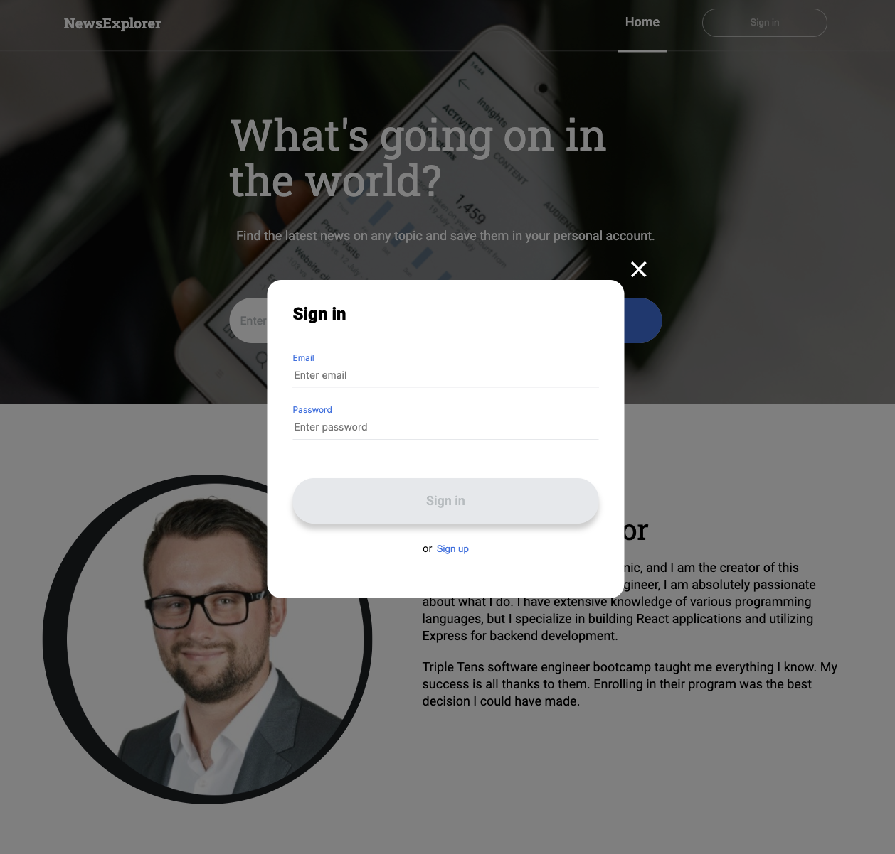
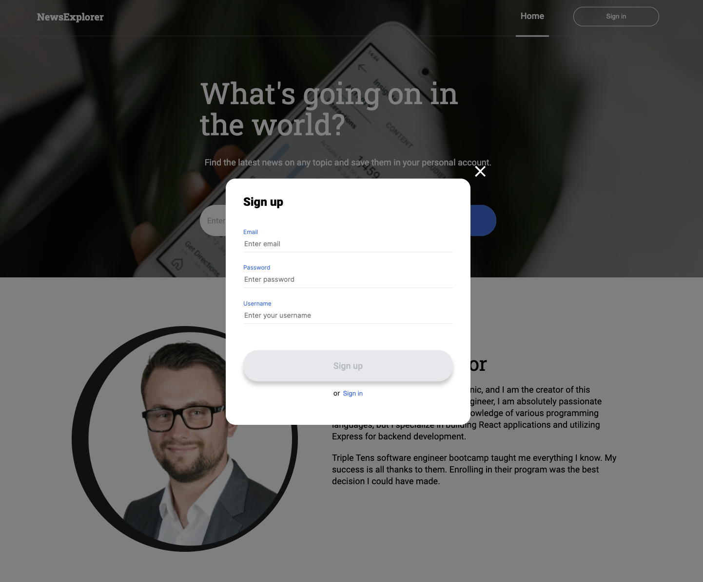
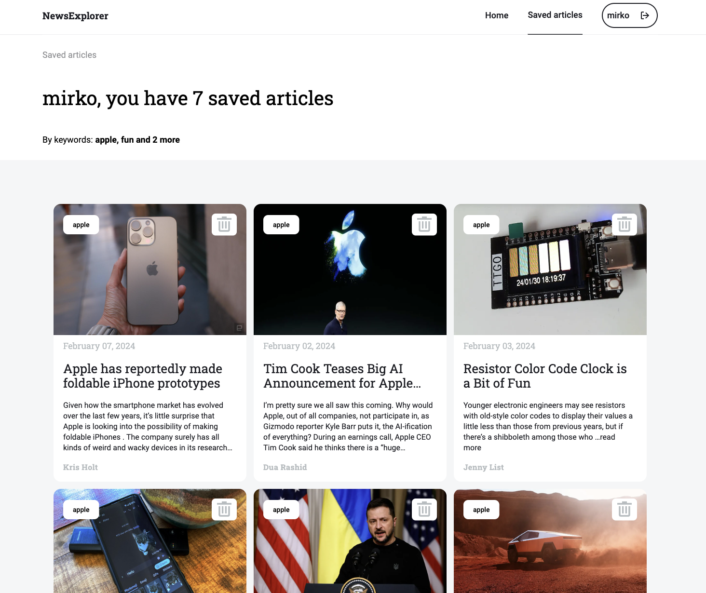

# News Explorer

## About the project

The idea of the application is pretty simple - we make a call to an API, which then responds with the daily news information. We collect the news data, process it, and then based on the search, the cards will appear based on the interest of the user. This cards can be saved to the profile when the user is logged in.

## Screeshot

Home Page

Login at Home Page

Signup at Home Page

Successfull Signup at Home Page

Saved Articles Page

## Figma

- [Link to the project on Figma](https://www.figma.com/file/z1bxDn7eBEDlsDhnZ9dtin/Your-Final-Project?type=design&node-id=0-1&mode=design&t=NSYlTl6dktigzXdM-0)

## Technologies

- HTML
- CSS
- Figma
- BEM
- JavaScript
- Git
- JSON
- Webpack
- GitHub
- Fetch API
- React

## Backend Repository Link:

- [Backend Repository Link](https://github.com/mirkozlatunic/news-explorer-backend)

**Created By [Mirko Zlatunic](https://github.com/mirkozlatunic)**
